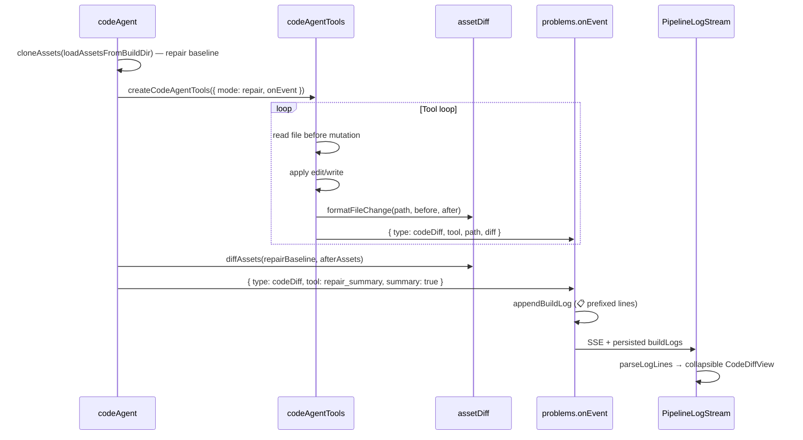

# Repair-mode CODE agent diff logs #22

**Status:** Implemented — branch `fix/issue-22-repair-diff-logs` (PR #26).

**GitHub issue:** [#22 — Author/CodeAgent Diff across codebases changed by CodeAgent in repair mode](https://github.com/rithvik89/devlabs/issues/22)

**Related:** [SPIN failure logs](spin-failure-logs.md) — how compose/runtime errors are persisted and passed to repair (separate from file diffs). [VALIDATE failure logs](validation-failure-logs.md) — judge feedback and inline evidence caps.

---

## Problem

During **CODE repair** (iteration 2+, or retry after SPIN/VALIDATE failure), the agent mutates files under `sandbox/builds/<id>/` via `edit_file`, `write_file`, and `write_files`.

Before #22, build logs only showed that a tool ran — for example:

```text
⚡ Step 2 · edit_file — edited services/order-service/app.js · 1.2s · $0.0012 · 4,200 in / 180 out
```

There was no before/after content, so it was impossible to audit what the agent actually changed from the pipeline UI alone.

**Goal:** Emit and display **observed file diffs** in repair mode — per mutating tool call, plus an optional end-of-repair summary — without changing scaffold behavior.

---

## Solution overview

| When | What is logged |
| ---- | -------------- |
| Each successful `edit_file` | Before/after for that file |
| Each successful `write_file` | Before (if existed) / after full content |
| Each successful `write_files` | One diff block per written file (batch capped) |
| End of CODE repair loop | Cumulative workspace diff (baseline → final assets) |

Scaffold mode is unchanged: no `codeDiff` events are emitted.

---

## Architecture



### Key modules

| Module | Role |
| ------ | ---- |
| `backend/pipeline/agents/codeAgentTools.ts` | Captures before/after on mutating tools; emits `codeDiff` when `mode === 'repair'` |
| `backend/pipeline/agents/codeAgent.ts` | Snapshots assets before repair loop; emits cumulative summary after loop |
| `backend/pipeline/helpers/assetDiff.ts` | Shared `formatFileChange`, `diffAssets`, size caps |
| `backend/routes/problems.ts` | Persists multi-line diff blocks into `draft.buildLogs` |
| `frontend/src/utils/pipelineLogFormat.ts` | Groups `📋` lines into `codeDiff` entries |
| `frontend/src/components/PipelineLogStream.tsx` | Renders collapsible monospace diff panels |
| `frontend/src/pages/PipelinePage.tsx` | Appends live SSE `codeDiff` events to the log stream |

---

## Event type

Defined in `backend/types/domain.ts`:

```ts
{ type: 'codeDiff'; tool: string; path: string; diff: string; summary?: boolean }
```

| Field | Per-tool diff | Repair summary |
| ----- | ------------- | -------------- |
| `tool` | `edit_file`, `write_file`, `write_files` | `repair_summary` |
| `path` | Relative workspace path | `(all changes)` |
| `diff` | Formatted before/after text | Full workspace diff from `diffAssets()` |
| `summary` | omitted / `false` | `true` |

This is separate from `{ type: 'log' }` and `{ type: 'codeStep' }`. Step summaries (`⚡ Step N · edit_file — edited path`) still come from `agentRuntime.runAgentWithTools`; diffs are additive detail.

---

## Diff text format

Produced by `formatFileChange()` in `assetDiff.ts`.

**Changed file** (labels `before` / `after` for per-tool diffs; `baseline` / `current` for summary):

```text
=== services/order-service/app.js (changed) ===
--- before ---
<previous content, capped>
+++ after +++
<new content, capped>
```

**Added file:**

```text
=== init/setup.sh (added) ===
<full content, capped>
```

**Removed file:**

```text
=== init/old.sh (removed) ===
<previous content, capped>
```

---

## Persisted log line format

`problems.ts` writes each diff as multiple lines in `buildLogs`:

**Per-tool:**

```text
📋 CODE diff · edit_file · services/order-service/app.js
📋  === services/order-service/app.js (changed) ===
📋  --- before ---
📋  ...
📋  +++ after +++
📋  ...
```

**Repair summary:**

```text
📋 CODE repair summary
📋  === docker-compose.yml (changed) ===
📋  --- baseline ---
📋  ...
📋  +++ current +++
📋  ...
```

The `📋  ` prefix (clipboard + two spaces) lets `parseLogLines()` reassemble multi-line blocks after page reload.

---

## Size limits

Shared constants from `assetDiff.ts`:

| Constant | Value | Applies to |
| -------- | ----- | ---------- |
| `MAX_DIFF_PER_FILE` | 6,000 chars | Each file’s before/after snippet |
| `MAX_DIFF_TOTAL` | 24,000 chars | Batch tool diffs + `diffAssets()` summary |
| `MAX_DIFF_PATHS` | 20 paths | Summary diff only (`diffAssets`) |

When a `write_files` batch would exceed the total cap, remaining per-file diffs are truncated with `…[remaining diffs truncated at total size limit]`.

---

## UI behavior

- **Per-tool diffs:** Collapsible `<details>` panel, badge **Diff**, open by default.
- **Repair summary:** Badge **Summary**, collapsed by default; title “Repair summary — all file changes”.
- Body rendered in `<pre class="log-code-diff-body">` (monospace).

Live builds receive `codeDiff` over SSE; `PipelinePage` uses `formatCodeDiffLines()` so live and persisted logs share the same shape.

---

## When repair mode runs

CODE enters repair when any of:

- SPIN failure message is present (`spinFailureMsg`)
- VALIDATE failure message is present (`validateFailureMsg`)
- `docker-compose.yml` exists and `attempt > 1`

See `buildPipeline.ts` (`codeMode` heuristic).

---

## Verification

1. Start a build that fails SPIN or VALIDATE, then retries (or reaches iteration 2+).
2. In the pipeline log stream, confirm **Diff** panels after each mutating tool call.
3. Confirm a **Summary** panel when the CODE repair loop finishes.
4. Reload the authoring/pipeline page — diffs should still render from persisted `buildLogs`.

---

## Related work

- **#24 — Lesson fix tracking** (`docs/lesson-fix-tracking.md`): Uses the same `assetDiff` helper to ground `fix_summary` in the `lessons` table. #22 surfaces diffs to **operators in the build UI**; #24 uses diffs for **downstream retry hints** in the DB. The helpers are shared; the consumers differ.
