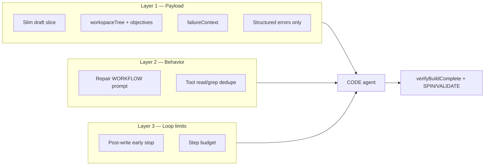

# Repair-mode CODE agent efficiency #21

**Status:** Implemented.

**GitHub issue:** [#21 — Author/CodeAgent (In Repair mode looking for faster bug resolution and unnecessary tool calls)](https://github.com/rithvik89/devlabs/issues/21)

**Related:** [SPIN failure logs](spin-failure-logs.md) (implemented — disk vs repair payload), [VALIDATE failure logs](validation-failure-logs.md) (current behavior — inline evidence + judge), [#24 lesson embeddings](lesson-fix-tracking.md) (out of scope here).

---

## Problem

**Scaffold** CODE runs in ~2 steps (~$0.05) because guardrails and early-stop keep the agent focused on writing files and stopping.

**Repair** CODE (iteration 2+, or retry after SPIN/VALIDATE failure) often runs ~24 steps (~$0.27, ~253k input tokens). Tokens compound across consecutive tool-loop steps even when the underlying fix is small.

| Mode | Typical steps | Typical cost | Typical input tokens |
| ---- | ------------- | ------------ | -------------------- |
| Scaffold | ~2 | ~$0.05 | Low |
| Repair | ~24 | ~$0.27 | ~253k |

**Goal:** Reduce repair iteration cost and tool-call count without sacrificing fix quality. Server-side verification (`verifyBuildComplete`, SPIN, VALIDATE) remains the correctness gate — the agent should not self-verify.

---

## Current context passed to the CODE agent

Every CODE invocation is a multi-step tool loop with three context layers.

### Layer A — System prompt (fixed, cached per loop)

- Large static block in `backend/pipeline/prompts/codeAgent.prompt.ts` (`SYSTEM_PROMPT_STATIC`)
- Covers tools, `challenge.json` / `docker-compose.yml` rules, validation graphs, scaffold invariants, and repair hints
- Plus one-line dynamic suffix (`SYSTEM_PROMPT_DYNAMIC`)

### Layer B — Initial user message (step 1, re-read every step)

Built in `runCodePhase` as:

```text
<mode hint line>

<JSON payload from buildCodeUserPayload()>
```

**Scaffold payload (slim):**

```json
{
  "mode": "scaffold",
  "draft": {
    "title": "...",
    "category": "...",
    "infra": { "services": [...] },
    "brokenState": { "rootCause": "...", "validationSymptoms": [...] },
    "sandboxSpec": { ... }
  },
  "lessonsBlock": { "relatedLessons": [] }
}
```

**Repair payload (heavy today):**

```json
{
  "mode": "repair",
  "draft": { "...full normalized authoring draft..." },
  "lessonsBlock": { "relatedLessons": [...] },
  "spinFailureMsg": { "message", "composeStdout", "composeStderr", "extractedErrors", "logFile", ... },
  "validateFailureMsg": { "message", "suggestions", "evidence": [...] },
  "previousAttempt": { "phase", "message", "rawText", "details" }
}
```

Repair mode is chosen in `buildPipeline.ts` when:

- SPIN failed last iteration, or
- VALIDATE failed last iteration, or
- `docker-compose.yml` exists and `attempt > 1`

`summariseBuildDir()` exists and is logged to the UI but is **not** sent to the LLM — the agent often calls `list_files` to discover the workspace.

### Layer C — Growing conversation history (steps 2–N)

`runToolLoop` in `backend/llm/client.ts` appends assistant turns + tool results after each step. Tool outputs are partially compacted (`read_file` → 240-char preview, `grep` → first 8 matches), but step count still drives token compounding.

### Scaffold-only protections repair lacks

| Mechanism | Scaffold | Repair |
| --------- | -------- | ------ |
| Slim payload | Yes | No — full `draft` |
| Workspace orientation in payload | N/A (creates from scratch) | No — agent explores via tools |
| Prompt stop rules | "Don't self-verify; stop with text summary" | Weak |
| Early stop | `createScaffoldEarlyStop` — halts after 2 consecutive read-only steps once core files exist | None |
| Max steps | 20 (often ~2 with early stop) | 25 |

---

## Solution overview

Three complementary layers. None alone guarantees minimal steps for every challenge; together they reduce noise, guide navigation, and cut post-fix verification spirals.



| Layer | Change | Primary effect |
| ----- | ------ | -------------- |
| 1 | Slim payload + `workspaceTree` + structured failure context | Smaller initial prompt; less `list_files` exploration |
| 2 | Repair WORKFLOW prompt + tool dedupe | Targeted multi-file reads; no duplicate lookups |
| 3 | Post-write early stop + step budget | Cuts verification spirals after fix is applied |

**Out of scope for #21:**

- Mid-loop context pruning in `client.ts`
- Re-enabling `search_code` / code-chunk embeddings (#24)
- Changes to validation or SPIN agents

---

## Layer 1 — Slim payload, workspace tree, structured errors

### 1a. Slim repair draft (same slice as scaffold)

Replace full `draft` in repair payload with:

```ts
draft: {
  title: draft.meta?.name || draft.title,
  category: draft.meta?.category || draft.category,
  infra: draft.infra,
  brokenState: {
    rootCause: draft.brokenState?.rootCause,
    validationSymptoms: draft.brokenState?.validationSymptoms,
  },
  sandboxSpec: draft.sandboxSpec,
}
```

Drop bulky authoring fields: `arch`, `metrics`, `problemStatement`, `codebase`, `data`, etc.

### 1b. `workspaceTree` with per-file objectives

Replace a flat workspace summary with a navigable tree built **server-side** (zero LLM cost) from disk + draft.

**Example shape:**

```json
{
  "workspaceTree": {
    "root": [
      {
        "path": "docker-compose.yml",
        "bytes": 1842,
        "objective": "Orchestration — service wiring, HOST_PORT placeholders, devlabs.role labels"
      },
      {
        "path": "challenge.json",
        "bytes": 3200,
        "objective": "Validation manifest — validationSpec.graphs, readyServices, terminalService"
      },
      {
        "path": ".devlabs/spin-failure.log",
        "bytes": 141000,
        "objective": "Full SPIN container logs — read when extractedErrors is insufficient"
      }
    ],
    "services": {
      "order-api": {
        "objective": "HTTP API (infra) — image_hint: python:3.11-alpine, roles: [api]",
        "files": [
          { "path": "services/order-api/app.py", "bytes": 2400, "objective": "Application entrypoint" },
          { "path": "services/order-api/Dockerfile", "bytes": 380, "objective": "Container build for order-api" }
        ]
      },
      "kafka": {
        "objective": "Message broker (infra) — image: confluentinc/cp-kafka:7.6.1",
        "files": []
      }
    },
    "init": [
      { "path": "init/init.sql", "bytes": 890, "objective": "Postgres seed schema" }
    ]
  }
}
```

**Objective sources (deterministic, v1):**

| Source | Contributes |
| ------ | ----------- |
| `draft.infra.services[]` | Service name, `image_hint`, `roles`, `notes` |
| `docker-compose.yml` | `devlabs.role` (infra / worker / one-shot), `build` vs `image` |
| `challenge.json` | Services in `validationSpec.graphs` / `readyServices` / `terminalService` |
| Path heuristics | `Dockerfile` → build, `app.py`/`index.js` → app code, `init/*` → DB seed |

**v1 uses deterministic sources only.** If `draft.infra.services[].notes` is consistently useful in practice, fold it into objectives in a follow-up.

**Implementation:** new helper `buildWorkspaceTree(buildDir, draft)` — likely in `backend/pipeline/helpers/workspaceTree.ts`, called from `buildCodeUserPayload()` when `mode === 'repair'`.

### 1c. `failureContext` — point agent at likely files

Optional companion to the tree, derived from the active failure:

```json
{
  "failureContext": {
    "phase": "SPIN",
    "message": "Dockerfile missing for order-api",
    "likelyFiles": ["services/order-api/Dockerfile", "docker-compose.yml"],
    "likelyServices": ["order-api"]
  }
}
```

**Derivation:**

- Regex-extract paths from error messages (`services/...`, `Dockerfile`, `docker-compose.yml`, `challenge.json`)
- Match service names from SPIN `extractedErrors` against `workspaceTree.services`
- For VALIDATE: map failed symptom ids → graphs → services in `validationSpec`

When paths are missing (common for vague VALIDATE feedback), `likelyFiles` may be empty — the tree + symptoms still guide investigation.

### 1d. Error context — structured extraction, not blind truncation

See **[SPIN failure logs](spin-failure-logs.md)** for the full spec (COMPOSE_UP vs SERVICE_RUNTIME, disk layout, repair payload shape).

Summary for repair payloads:

| Field | Treatment |
| ----- | --------- |
| `message` | Keep (capped at capture) |
| `extractedErrors[]` | Primary SPIN signal — path-prioritized extraction |
| Raw stdout/stderr/container logs | **Never inline** — on disk under `.devlabs/` |
| `logFile`, `logBytes`, `logLineCount`, `note` | Metadata + pointer for agent `read_file` / grep |
| `failureKind`, `exitCode`, `psSnapshot`, `psFile` | Kind-specific fields (see spin-failure-logs doc) |
| `validateFailureMsg.message` / `suggestions` | Never cap |
| `validateFailureMsg.evidence[]` | Already capped per-field in `buildPipeline.ts` — keep as-is |

---

## Layer 2 — Prompt workflow and tool dedupe

### 2a. Repair WORKFLOW (prompt section)

Add to `codeAgent.prompt.ts`, parallel to scaffold WORKFLOW:

```text
REPAIR WORKFLOW
1. ORIENT — read failureContext + workspaceTree. Identify candidate files from
   error paths, service names, and symptom → service mapping. Do NOT list_files.

2. INVESTIGATE — read/grep only files justified by the failure:
   - SPIN/Dockerfile/build errors → service Dockerfiles, compose, deps files
   - VALIDATE/evidence gaps → challenge.json validationSpec + services in that graph
   - Unclear path → one targeted grep, then read matching files from the tree
   Rules:
   - Never read the same path twice
   - Never grep the same pattern twice
   - Prefer read_file with line ranges over full-file reads for large files
   - Use workspaceTree objectives to pick files, not random exploration

3. FIX — edit_file for surgical changes; write_file when replacing whole files.
   Multi-file fixes are fine — batch related writes in one step when possible.

4. STOP — once all intended edits are done, reply with a text summary.
   Do NOT re-read or grep to self-verify; server runs verifyBuildComplete next.
```

**Strengthen `REPAIR_USER_HINT`** with the same themes: no `list_files` for orientation (tree is in payload), no post-fix verification reads.

Multi-file reads are explicitly allowed. The constraint is **specific, non-duplicative** lookups — not a hard "one read max."

### 2b. Tool-layer read/grep dedupe

Prompt rules alone are soft. Enforce in `createCodeAgentTools()` for repair mode:

- Track `readPaths: Set<string>` and `grepKeys: Set<string>` per loop session
- Second `read_file` on the same path → return error with reminder of prior preview
- Duplicate `grep` pattern (+ optional path scope) → return error with prior match summary

This prevents the most common waste pattern (re-reading the same file 5 times) without blocking legitimate multi-file investigation.

---

## Layer 3 — Loop limits (honest expectations)

Early stop is **not a correctness guarantee** and does not promise minimal steps for every challenge type. It targets one failure mode: **post-fix verification spirals** (grep → read → grep after the edit is already applied).

`verifyBuildComplete`, SPIN, and VALIDATE remain the real quality gates.

### 3a. Post-write early stop

New `createRepairEarlyStop()` in `codeAgent.ts`:

```text
State:
  hasWritten: boolean          — true after any successful write_file / write_files / edit_file
  readOnlyStreakAfterWrite: number

Rules:
  BEFORE first write  → never stop early (agent may read many files across a multi-file fix)
  AFTER first write:
    - Stop if step has no tool calls (model returned text-only summary), OR
    - Stop if 2 consecutive steps are read-only only (list_files / read_file / grep)
```

Same pattern as scaffold's `createScaffoldEarlyStop`, but gated on `hasWritten`.

**What it handles well:**

- Fix applied → agent greps/reads repeatedly to "verify" → stopped at step 2 of post-write read streak

**What it does not guarantee:**

- Complex bugs needing 6+ reads across 4 files before first edit (fine — no stop until after write)
- Multi-file fixes where agent reads file B after fixing A to assess next change (may need 3-streak threshold — tune from logs)

### 3b. Step budget

Keep a hard ceiling as backstop:

- Lower `MAX_STEPS_REPAIR` from 25 → 15 (or 12)
- Early stop should handle most cases in 2–8 steps; budget catches runaway loops

### 3c. What we do not rely on

- Fixed step count for all challenge types
- "Stop on text-only step" as a forced behavior — the loop already ends when the model returns no tool calls; early stop is additive
- Early stop before the first write

---

## Revised repair payload (target)

```json
{
  "mode": "repair",
  "draft": {
    "title": "...",
    "category": "...",
    "infra": { "services": [...] },
    "brokenState": { "rootCause": "...", "validationSymptoms": [...] },
    "sandboxSpec": { ... }
  },
  "workspaceTree": { "root": [...], "services": { ... }, "init": [...] },
  "failureContext": {
    "phase": "VALIDATE",
    "message": "...",
    "likelyFiles": ["challenge.json", "services/product-catalog-service/app.py"],
    "likelyServices": ["product-catalog-service"]
  },
  "lessonsBlock": { "relatedLessons": [...] },
  "spinFailureMsg": null,
  "validateFailureMsg": {
    "message": "...",
    "suggestions": [...],
    "evidence": [...]
  },
  "previousAttempt": {
    "phase": "VALIDATE",
    "message": "...",
    "rawText": "...",
    "details": { "message": "..." }
  }
}
```

When SPIN failed, `spinFailureMsg` contains `message`, `extractedErrors`, `logFile`, `logBytes`, `logLineCount`, `hint` — **not** inline `composeStdout` / `composeStderr`.

---

## Files to change

| File | Change |
| ---- | ------ |
| `backend/pipeline/helpers/workspaceTree.ts` | **New** — `buildWorkspaceTree()`, `buildFailureContext()` |
| `backend/pipeline/agents/codeAgent.ts` | Slim repair payload; wire tree + failureContext; `createRepairEarlyStop()` |
| `backend/pipeline/prompts/codeAgent.prompt.ts` | REPAIR WORKFLOW section; stronger `REPAIR_USER_HINT` |
| `backend/pipeline/helpers/spinFailureLogs.ts` | Drop inline stdout/stderr from `spinFailureForRepair()`; path-safe extraction |
| `backend/pipeline/agents/codeAgentTools.ts` | Repair-mode read/grep dedupe session tracking |

---

## Verification plan

### Unit / helper checks

- `buildWorkspaceTree()` — given a fixture build dir + draft, produces expected tree nodes and objectives
- `buildFailureContext()` — extracts paths from sample SPIN/VALIDATE error strings
- `buildCodeUserPayload('repair', …)` — excludes full draft fields; includes tree
- `spinFailureForRepair()` — no `composeStdout` / `composeStderr` keys
- Dedupe — second `read_file` same path returns error in repair mode

### Integration

Trigger a build that fails SPIN or VALIDATE, then observe repair iteration:

| Metric | Before (baseline) | Target |
| ------ | ----------------- | ------ |
| Steps | ~24 | 2–10 (purposeful; complex multi-file fixes may legitimately need more) |
| Input tokens | ~253k | ~30–80k |
| Cost | ~$0.27 | ~$0.05–0.12 |
| Fix quality | Passes retry | Same — SPIN/VALIDATE still pass |

### Regression

- Scaffold unchanged: ~2 steps, early stop on read-only streak, slim payload
- Repair diff logs (#22) still emit per-tool and summary diffs

### Edge cases

| Case | Expected behavior |
| ---- | ----------------- |
| SPIN failure, thin `extractedErrors` | Agent reads `.devlabs/spin-failure.log` once (tree shows it) |
| VALIDATE vague feedback, no paths | Agent uses symptom → service mapping + tree; targeted grep allowed |
| Multi-file fix (compose + 2 Dockerfiles) | Multiple reads before first write; multiple edits; no duplicate reads |
| Post-fix verification grep loop | Early stop after 2 read-only steps post-write |

---

## Expected outcome

Repair should behave more like scaffold: **small actionable payload**, **tree-guided navigation**, **non-duplicative reads**, and **post-fix spiral prevention** — without changing server verification.

Complex challenges may still need 8–10 steps. The goal is eliminating 24-step loops where most steps are redundant exploration or post-fix self-verification.

---

## Implementation branch

```text
fix/issue-21-repair-mode-efficiency
```

Suggested commit message:

```text
fix(#21): slim repair payload, workspace tree, and repair loop guardrails
```
