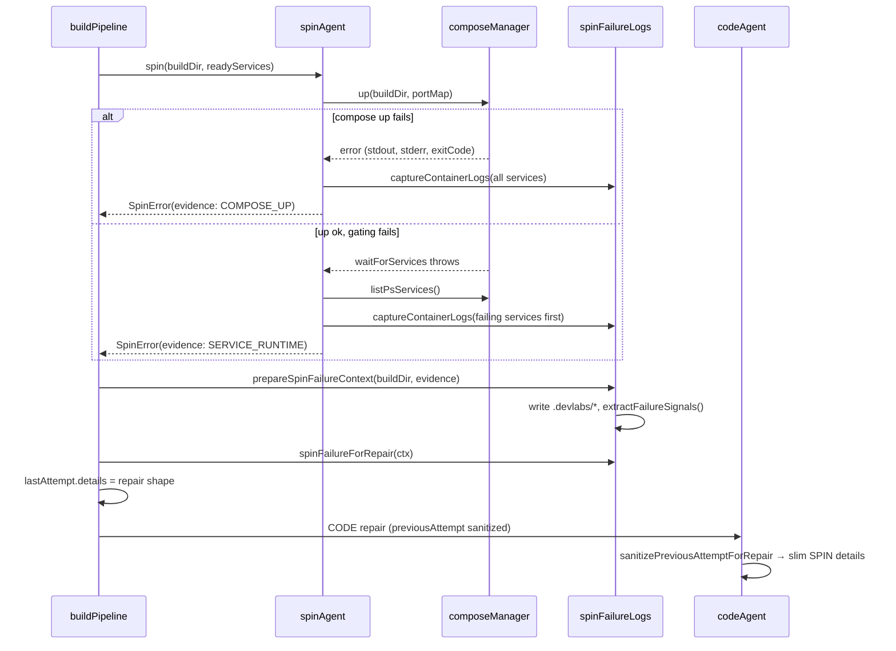

# SPIN failure logs and repair evidence

**Status:** Implemented.

**Related:** [#21 repair-mode efficiency](repair-mode-efficiency.md), [#22 repair diff logs](repair-diff-logs.md), [VALIDATE failure logs](validation-failure-logs.md), [lesson fix tracking](lesson-fix-tracking.md).

---

## Problem

SPIN (`docker compose up --build` + service gating) can fail in two very different ways:

1. **Compose never comes up** — build errors, bad Dockerfile, image pull failures, bind/port conflicts.
2. **Compose starts but services are unhealthy** — crash loops, dead containers, missing `readyServices`.

Raw `stdout` / `stderr` / container logs can be tens of thousands of lines. Inlining them into the CODE agent repair payload wastes tokens and often truncates the lines that matter (paths, Dockerfile line numbers, stack traces).

**Goal:** Persist full logs on disk under the build workspace; pass a compact, structured repair payload to the CODE agent and lesson store.

---

## Two failure kinds

| Kind | When | Primary signal |
| ---- | ---- | -------------- |
| `COMPOSE_UP` | `docker compose up` exits non-zero before gating completes | Compose CLI stdout/stderr + optional early container logs |
| `SERVICE_RUNTIME` | `up` succeeds; `waitForServices` throws (dead/exited/stuck/missing ready service) | Abbreviated `docker compose ps` snapshot + targeted container logs |

Classification happens in `spinAgent.ts` via an `upSucceeded` flag set after a successful `composeManager.up()`.

---

## Disk vs LLM prompt

| Field | Written to disk | In repair payload |
| ----- | --------------- | ----------------- |
| Full compose stdout | `.devlabs/spin-compose-up.stdout` (`COMPOSE_UP` only) | **Never** |
| Full compose stderr | `.devlabs/spin-compose-up.stderr` (`COMPOSE_UP` only) | **Never** |
| Merged log body | `.devlabs/spin-failure.log` | **Never** (path + size only) |
| Full `docker compose ps` JSON | `.devlabs/spin-ps.json` (`SERVICE_RUNTIME` only) | **Never** (path only) |
| `message` | — | Yes (≤500 chars at capture time) |
| `extractedErrors[]` | — | Yes (≤40 lines, ≤500 chars/line) |
| `logFile`, `logBytes`, `logLineCount` | — | Yes (metadata) |
| `note` | — | Yes — tells agent where full logs live |
| `exitCode` | — | Yes (`COMPOSE_UP` only) |
| `psSnapshot` | — | Yes, abbreviated (`SERVICE_RUNTIME` only) |
| `psFile` | — | Yes (`SERVICE_RUNTIME` only) |

The CODE agent should treat `extractedErrors` as the primary signal and read `.devlabs/spin-failure.log` (or grep it) only when that list is insufficient. The `note` field states this explicitly.

---

## On-disk layout

All paths are relative to the build workspace (`sandbox/builds/<buildSessionId>/`):

```text
.devlabs/
  spin-compose-up.stdout   # COMPOSE_UP — raw compose CLI stdout
  spin-compose-up.stderr   # COMPOSE_UP — raw compose CLI stderr
  spin-failure.log         # merged body used for extraction + agent read_file
  spin-ps.json             # SERVICE_RUNTIME — full `docker compose ps -a --format json`
  errors/
    latest.json            # existing build-failure record (unchanged)
```

**`spin-failure.log` contents by kind:**

- **`COMPOSE_UP`:** stderr + stdout + optional container logs (joined).
- **`SERVICE_RUNTIME`:** container logs only (failing services first, then all).

---

## End-to-end flow



---

## Repair payload shape

After `spinFailureForRepair()`, `previousAttempt.details` for a SPIN failure looks like:

```json
{
  "failureKind": "COMPOSE_UP",
  "message": "compose up failed (exit 1): failed to solve: Dockerfile:12",
  "exitCode": 1,
  "extractedErrors": [
    "failed to solve: Dockerfile:12",
    "services/api/Dockerfile: RUN pip install -r requirements.txt"
  ],
  "logFile": ".devlabs/spin-failure.log",
  "logBytes": 8420,
  "logLineCount": 312,
  "note": "Full logs are on disk at .devlabs/spin-failure.log. Use read_file or grep when extractedErrors is insufficient."
}
```

**`SERVICE_RUNTIME` example** (no `exitCode`; adds ps fields):

```json
{
  "failureKind": "SERVICE_RUNTIME",
  "message": "service \"api\" dead: Exited (1)",
  "psSnapshot": "api: exited — Exited (1) 2 seconds ago\npostgres: running — Up 5 seconds",
  "psFile": ".devlabs/spin-ps.json",
  "extractedErrors": ["Traceback (most recent call last):", "ModuleNotFoundError: No module named 'flask'"],
  "logFile": ".devlabs/spin-failure.log",
  "logBytes": 1204,
  "logLineCount": 48,
  "note": "Full logs are on disk at .devlabs/spin-failure.log. ... Full compose ps snapshot is at .devlabs/spin-ps.json."
}
```

Raw stdout/stderr/logs are **not** keys on this object.

---

## Signal extraction

`extractFailureSignals()` in `spinFailureLogs.ts` scans merged log text for high-signal lines:

- Matches error-like patterns (`ERROR`, `Traceback`, `failed to solve`, `Dockerfile:`, exit codes, etc.).
- Skips noisy debug/info prefixes.
- Dedupes and caps at 40 lines.
- **Prioritizes lines containing path-like tokens** (`services/`, `.py`, `Dockerfile`, `docker-compose.yml`, etc.) so file paths survive caps.

For **`COMPOSE_UP`**, `buildComposeUpMessage()` builds the one-line `message` from exit code + last meaningful stderr/stdout line (Dockerfile/build errors preferred).

For **`SERVICE_RUNTIME`**, `abbreviatePsSnapshot()` produces the inline ps block (failing services first, max ~20 services, capped total length). Full JSON is always on disk at `psFile`.

---

## Container log capture

`captureContainerLogs(buildDir, portMap, failingServiceNames?)`:

1. If failing service names are known (`SERVICE_RUNTIME`), fetch logs per failing service first (`tail: 150`).
2. If that yields nothing, fall back to all-service logs (`tail: 200`).
3. Output is stripped of Docker progress noise via `composeManager.stripDockerNoise()` before persistence.

This avoids dumping every service's logs when only one container crashed.

---

## Downstream consumers

| Consumer | What it uses |
| -------- | ------------ |
| **CODE agent** | `previousAttempt.details` (sanitized via `sanitizePreviousAttemptForRepair`) + `failureContext` from `buildFailureContext()` |
| **workspaceTree** | `extractedErrors`, `psSnapshot` — path/service extraction for `likelyFiles` / `likelyServices` |
| **lessonStore** | Anchor snapshot: `failureKind`, `message`, `extractedErrors`, `psSnapshot` (no raw logs) |
| **Pipeline UI** | `emitLog` detail with counts and first 8 extracted errors — not full log bodies |
| **spinAgent preview log** | First 40 lines of a local preview source for operator visibility only |

`sanitizePreviousAttemptForRepair()` re-shapes SPIN details through `spinFailureForRepair()` so even if `lastAttempt.details` picked up extra keys, the LLM never sees raw streams.

---

## Key files

| File | Role |
| ---- | ---- |
| `backend/pipeline/agents/spinAgent.ts` | Runs compose up + gating; throws `SpinError` with typed `evidence` |
| `backend/pipeline/helpers/spinFailureLogs.ts` | Persistence, extraction, `spinFailureForRepair()` |
| `backend/pipeline/pipelines/buildPipeline.ts` | SPIN catch → `prepareSpinFailureContext` → `lastAttempt.details` |
| `backend/pipeline/helpers/repairAttempt.ts` | `slimSpinDetails`, `failureTextForLessons` |
| `backend/pipeline/helpers/workspaceTree.ts` | `buildFailureContext()` SPIN branch |
| `backend/pipeline/stores/lessonStore.ts` | Anchor failure text for embeddings |
| `backend/sandbox/composeManager.ts` | `listPsServices()`, `waitForServices()`, `logs()` |

---

## Operator notes

- **Do not** merge compose stdout/stderr/container logs into a single inline `logs` field on repair payloads — that regresses token cost and truncation behavior.
- **`note`** (formerly `hint`) is the agent-facing pointer to on-disk files; keep it in sync with actual paths written by `prepareSpinFailureContext()`.
- For local debugging, `sandbox/spin-failure-demo/` contains a minimal compose setup that can exercise both failure paths.

---

## Verification

1. **COMPOSE_UP:** Introduce a Dockerfile syntax error → confirm `.devlabs/spin-compose-up.*` and `spin-failure.log` exist; repair payload has `failureKind: "COMPOSE_UP"` and no inline stdout/stderr.
2. **SERVICE_RUNTIME:** Fix Dockerfile but leave app crashing on start → confirm `spin-ps.json`, abbreviated `psSnapshot`, targeted container logs in `spin-failure.log`.
3. **Repair iteration:** CODE agent receives `previousAttempt.details.extractedErrors` and can `read_file(".devlabs/spin-failure.log")` when needed.
4. **Lessons:** After SPIN eventually passes, lesson anchor includes `failureKind` + extracted errors (not raw compose streams).
