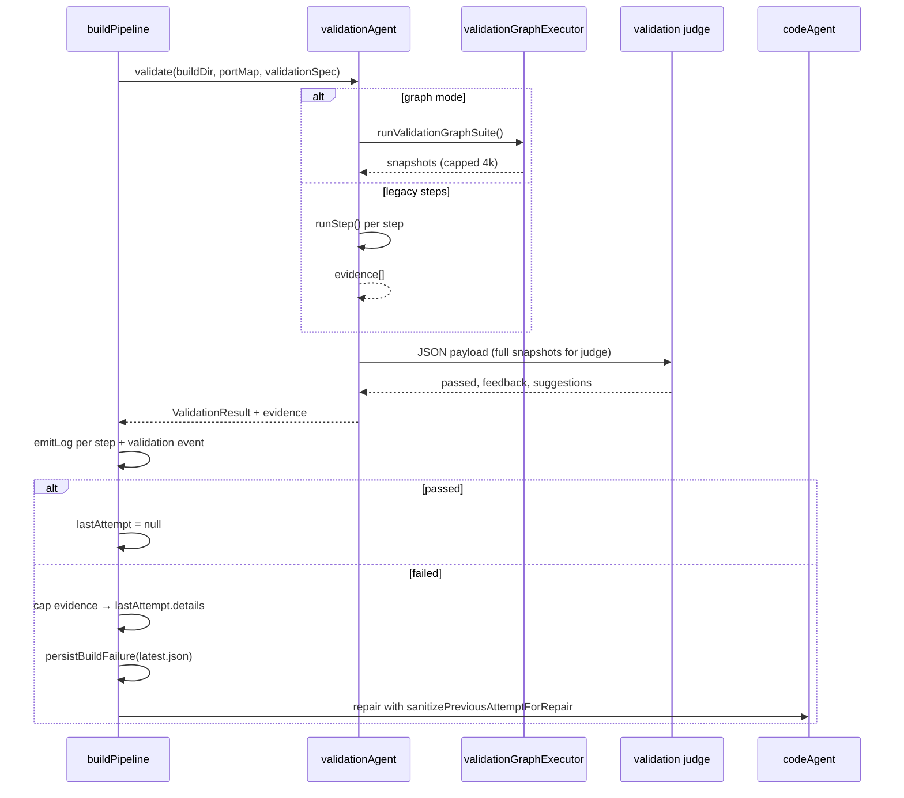

# VALIDATE failure logs and repair evidence

**Status:** Current behavior (as implemented).

**Related:** [SPIN failure logs](spin-failure-logs.md), [#21 repair-mode efficiency](repair-mode-efficiency.md), [lesson fix tracking](lesson-fix-tracking.md).

---

## Overview

VALIDATE is structurally different from SPIN:

| | SPIN | VALIDATE |
| --- | --- | --- |
| **What runs** | `docker compose up` + service gating | HTTP/exec/metric checks or validation graphs + **LLM judge** |
| **Failure meaning** | Infrastructure won't start or stay up | Broken state not observable (or graph aborted) |
| **Full logs on disk** | Yes (`.devlabs/spin-*`) | **No** dedicated validation log files |
| **Repair signal** | `extractedErrors` + log file pointer | Judge `feedback` + `suggestions` + capped `evidence[]` |
| **Inline in repair payload** | Never raw compose logs | Yes — evidence is inlined (with caps) |

VALIDATE evidence is **structured observation data** (HTTP bodies, exec stdout, graph snapshots), not docker compose streams. Today it is capped and passed inline to the CODE agent rather than persisted separately like SPIN logs.

---

## Two execution paths

### 1. Legacy steps (`validationSpec.steps`)

Used when `validationSpec.graph` / `graphs` is absent.

| Step type | What is captured |
| --------- | ---------------- |
| `http` | `statusCode`, response body in `stdout`, fetch errors in `error` |
| `exec` | `stdout`, `stderr` from `docker compose exec` |
| `metricCheck` | Tail of load-generator logs; peak metric value appended to `stdout` |

Each step runs via `validationAgent.runStep()` → optional `step.check` via `evaluateCheck()`.

### 2. Graph validation (`validationSpec.graphs[]` or legacy single `graph`)

Preferred path. One DAG per design `validationSymptom`.

- Action nodes: `http`, `exec`, `background`, `wait`, `fork`, `join`, `stop`
- Each action produces a `ValidationGraphNodeSnapshot` with `label`, `ok`, `error`, `body`, `stdout`, `stderr`, structured `snapshot`
- **No programmatic pass/fail on broken state** — runner records observations; the LLM judge decides if `brokenState` is proven

Graph snapshots are capped at **4000 chars** for body/stdout and **1000** for stderr in `validationGraphExecutor.ts`.

---

## Live pipeline logs (operator UI)

During VALIDATE, `validationAgent` emits logs through `onLog` → `buildPipeline` → SSE → `PipelineLogStream`.

**Legacy steps:**

```text
Running N validation check(s)
Step: http → api-service/health
✓ api-service/health          (or ✗ with detail)
```

Log `detail` for each step (failure or success preview):

- `error`, or `status N`, or **`stdout.slice(0, 400)`**

**Graph mode:**

```text
Running M validation graph(s) (K action nodes) — one per design symptom
Symptom 1 (1/M): <symptomCheck>
Graph [symptom 1]: nodeId → GET api/products
✓ [1] GET api/products        (or ✗)
```

Log `detail` per action node:

- `error`, or `snapshot`, or **`body.slice(0, 400)`**

**Judge:**

```text
Asking validation judge to evaluate snapshots…
Judge: PASS | Judge: FAIL
detail: <feedback string>
```

On judge completion, the full `ValidationResult` is also sent as a `{ type: 'validation', result }` event. The pipeline UI renders it in `ValidationCard` — feedback, suggestions, and expandable raw `evidence` JSON.

---

## LLM judge input (validation agent internal)

When an LLM key is configured, `validationAgent.validate()` builds a JSON user message for the judge.

**Legacy evidence** (sent to judge):

```json
{
  "step": { "type": "http", "service": "api", "path": "/health" },
  "ok": false,
  "statusCode": 500,
  "stdout": "<response body, max 4000 chars>",
  "stderr": "<max 1000 chars>",
  "error": "..."
}
```

**Graph run** (sent to judge):

- Full `graphRun` object with per-symptom graphs and snapshots
- Each snapshot: `body`, `stdout` capped at 4000; includes parsed `snapshot.responseBody` where applicable
- `nodeOutcomes` map for quick lookup

The judge returns `<validation_result>{ passed, feedback, suggestions }</validation_result>`.

If no LLM key: runner outcomes only — `passed = all steps ok` (legacy) or graph not aborted (graph); generic feedback string.

---

## Failure paths in `buildPipeline`

### A. Judge FAIL (normal path)

Services are still up when validation runs. On `validation.passed === false`:

```typescript
lastAttempt = {
  phase: 'VALIDATE',
  message: validation.feedback,
  details: {
    feedback: validation.feedback,
    suggestions: validation.suggestions,
    evidence: cappedEvidence,  // per-item caps applied here
  },
};
```

**Per-evidence caps in `buildPipeline.ts`:**

| Field | Cap |
| ----- | --- |
| `body` | 500 chars |
| `stdout` | 1500 chars |
| `stderr` | 800 chars |
| `step`, `label`, `ok`, `statusCode`, `error` | preserved |

Then: compose down, lesson anchor snapshot, `persistBuildFailure()` → `.devlabs/errors/latest.json`.

### B. Runtime exception (`validate()` throws)

Rare — e.g. compose read failure, unexpected executor error.

```typescript
lastAttempt = {
  phase: 'VALIDATE',
  message: err.message,
  details: null,   // no evidence
};
```

Repair gets only the exception message — **no structured evidence**.

### C. VALIDATE pass

`lastAttempt = null`; optional validate fix-lesson recorded if a prior failure existed in the window.

---

## Repair payload (CODE agent)

Repair mode passes `previousAttempt` through `sanitizePreviousAttemptForRepair()` in `repairAttempt.ts`.

**VALIDATE branch (`slimValidateDetails`):**

```json
{
  "message": "<validation.feedback>",
  "feedback": "<capped at 400 chars>",
  "suggestions": ["...", "..."],
  "evidence": [
    {
      "step": { "type": "http", "service": "api", "path": "/products" },
      "ok": false,
      "label": "GET api/products",
      "statusCode": 200,
      "body": "<500 chars>",
      "stdout": "<1500 chars>",
      "stderr": "<800 chars>",
      "error": null
    }
  ]
}
```

Additional limits:

- **Max 20 evidence items** (`slimValidateEvidence`)
- **Max 8 suggestions**

There is **no** `logFile`, `note`, or on-disk pointer — unlike SPIN. The agent is expected to work from `feedback`, `suggestions`, and inline `evidence`.

`buildFailureContext()` (workspace tree) also derives:

- `likelyFiles` / `likelyServices` from evidence labels, bodies, suggestions
- `failedNodes[]` — failed evidence entries with `label`, `statusCode`, `body` (500 chars)
- `actionHint` — e.g. Decimal/JSON hint, or “edit handler for failed node X”

---

## Disk persistence

| Location | Contents |
| -------- | -------- |
| `.devlabs/errors/latest.json` | `phase`, `message`, full `detail` (= `lastAttempt.details`) — **includes capped evidence inline** |
| `.devlabs/errors/<timestamp>-validate.json` | History copy of same |
| Dedicated validate log files | **None** |

SPIN writes separate log files so the agent can `read_file` full streams. VALIDATE does not — all observation data lives in JSON evidence on the attempt record.

---

## Lesson store anchor

On first VALIDATE failure in a lesson window, `captureFailureSnapshot()` stores:

- `message` (judge feedback, capped 600)
- `feedback`, `suggestions` (from details)
- `composeSnippet` (docker-compose.yml excerpt — context only)

`lessonStore.buildAnchorFailureInput()` includes feedback and suggestions for LLM distillation into `failure_summary`. No raw HTTP bodies beyond what appears in distilled text.

---

## End-to-end flow



---

## Comparison with SPIN (gaps)

| Concern | SPIN (implemented) | VALIDATE (today) |
| ------- | ------------------ | ---------------- |
| Full raw logs on disk | Yes | No — only capped JSON in `latest.json` |
| Repair payload avoids bulk | Yes — `extractedErrors` + `logFile` | Partial — evidence inlined up to ~20 × ~2.8k chars |
| Failure taxonomy | `COMPOSE_UP` / `SERVICE_RUNTIME` | Judge FAIL vs exception only |
| Exception path | Still gets structured evidence | `details: null` |
| Agent read_file fallback | `.devlabs/spin-failure.log` | Nothing equivalent |
| Signal extraction | Path-prioritized `extractedErrors` | Judge `suggestions` + manual evidence scan |

These gaps are acceptable today because VALIDATE evidence is already structured and smaller than compose logs — but large graph suites or verbose HTTP bodies can still bloat repair tokens.

---

## Key files

| File | Role |
| ---- | ---- |
| `backend/pipeline/agents/validationAgent.ts` | Run steps/graphs, call judge, emit live logs |
| `backend/pipeline/validation/validationGraphExecutor.ts` | Graph DAG execution, snapshot caps |
| `backend/pipeline/validation/validationChecks.ts` | Step-level check evaluation |
| `backend/pipeline/pipelines/buildPipeline.ts` | VALIDATE catch, `cappedEvidence`, `lastAttempt`, failure persistence |
| `backend/pipeline/helpers/repairAttempt.ts` | `slimValidateDetails`, `slimValidateEvidence` |
| `backend/pipeline/helpers/workspaceTree.ts` | `buildFailureContext()` VALIDATE branch |
| `backend/pipeline/build/buildFailureRecord.ts` | `.devlabs/errors/latest.json` |
| `backend/pipeline/stores/lessonStore.ts` | Anchor failure text for embeddings |
| `frontend/src/pages/PipelinePage.tsx` | `ValidationCard` — full evidence in UI |

---

## Possible future improvements (not implemented)

If VALIDATE repair token cost becomes a problem (similar to pre-SPIN-refactor):

1. **Persist full evidence** to `.devlabs/validate-evidence.json` (or per-symptom files).
2. **Repair payload** — pass `feedback`, `suggestions`, failed-node summaries only + `evidenceFile` pointer (mirror SPIN `note`).
3. **Exception path** — capture partial graph snapshots before throw.
4. **Failure kinds** — e.g. `JUDGE_REJECT` vs `GRAPH_ABORTED` vs `RUNNER_EXCEPTION` for targeted repair hints.

---

## Verification

1. **Legacy FAIL:** Build with wrong handler → judge FAIL → `lastAttempt.details.evidence` has capped bodies; UI shows ValidationCard with full evidence.
2. **Graph FAIL:** Symptom graph completes but judge rejects broken-state proof → snapshots in evidence with `label`, `symptomId`.
3. **Repair iteration:** CODE agent receives `previousAttempt` with `feedback` + `suggestions` + slimmed evidence; `failureContext.failedNodes` lists failing labels.
4. **Exception:** Force validate throw → confirm `details: null` and weak repair context (known gap).
5. **Disk:** `.devlabs/errors/latest.json` contains same capped detail as `lastAttempt.details`.
